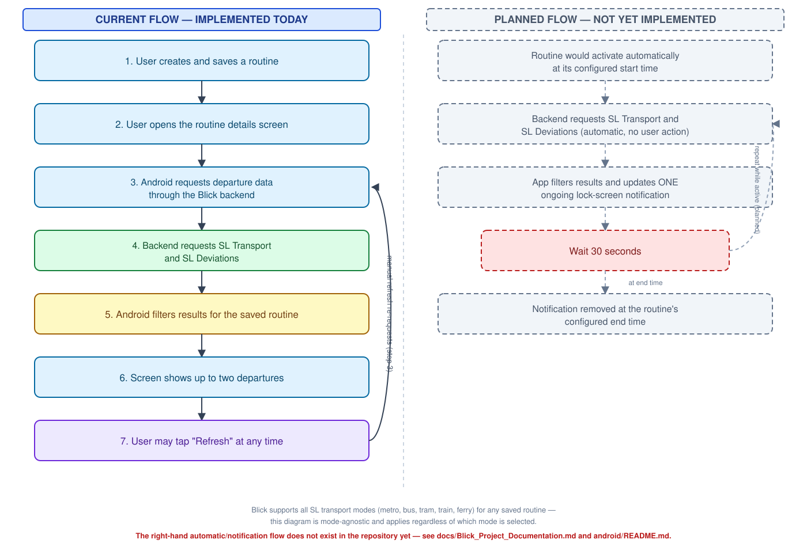

# Blick

A scheduled Android departure display for regular SL commuters, across any SL transport
mode (bus, metro, train, tram, ferry). Users choose a stop, transport mode, line,
direction, weekdays, and time window; during that period, upcoming departures appear in
one quiet, updating lock-screen notification. Blick requests promotion of that
notification to Android 16's Live Update surface, but Android — and, on Samsung
devices, One UI — alone decides whether it actually renders as a prominent Now Bar card;
a plain ongoing notification is the automatic, transparent fallback wherever it doesn't.
The backend also retrieves and normalizes SL disruption data, though the Android client
does not yet request, consume, or surface it anywhere (see
`docs/Blick_Project_Documentation.md`'s "Not yet implemented" list). See
`docs/Blick_Project_Documentation.md` for the full product specification.

## Repository layout

```
blick/
├── android/    Kotlin + Jetpack Compose client (see android/README.md)
├── backend/    TypeScript/Hono proxy in front of SL Transport + SL Deviations
│               (see backend/README.md)
├── docs/
│   ├── Blick_Project_Documentation.md / .pdf         the product spec
│   ├── api-contract.md                              backend API contract + upstream
│   │                                                  field-by-field mapping
│   └── framework.svg                                 end-to-end data flow diagram
└── .github/workflows/   CI: backend-ci.yml (Node 22 typecheck/lint/test/build/audit),
                          android-ci.yml (JDK 17 wrapper validation, assembleDebug,
                          lintDebug, testDebugUnitTest)
```

## How it works



**Currently implemented:** the user creates a routine (any of the supported SL
transport modes — bus, metro, train, tram, ferry), which is saved locally and scheduled
for its next active window via WorkManager (best-effort, not exact — see
`android/README.md`). Whether or not the app is open, that window activates
automatically, requesting departures for the routine through the backend (which in
turn requests SL Transport), filtering the result down to what matches the saved
routine, and showing up to two matching departures in one ongoing, lock-screen-visible
notification — requesting Live Update promotion as described above — that updates
silently about every 30 seconds and is removed at the routine's configured end time. A
debug-only manual "Show/update test notification" control also remains available in
debug builds. Separately, opening the routine's details screen fetches
immediately and again automatically about every 30 seconds while that screen stays
open — independent of the notification loop — with manual Refresh also available.
(SL Deviations is not part of this automatic flow — see the intro above.)

The notification also always carries a Stop action ("Stop/Unpin" the current window
early — same effect as "pause for today").

A home-screen widget shows the same routine/station/direction and next-two-departures
information during the active window — updated from the exact same ~30-second worker
loop, never a separate refresh mechanism — and reads exactly **"No active commute."**
outside it. Tapping the widget opens the routine's details screen. See
`android/README.md`'s Status section for the full account.

## Status

Foundation plus a real, largely end-to-end feature set, device-verified on a physical
tablet and on a real Samsung Galaxy S23 Ultra (One UI 8.5, Android 16), where the full
notification/scheduling loop (single stable notification, ~30-second refresh, lock-screen
visibility, Stop action) was confirmed in its default, non-promoted state — the exact
experience a regular user has today. The promoted Live Update / Now Bar card itself only
appeared on that device behind Settings → Developer options → "Live notifications for
all apps," a Samsung-imposed restriction with no known removal date — see
`android/README.md`'s Known limitations for why that's Samsung's decision, not a fixable
Blick gap. The backend's contract,
normalization, and caching logic are implemented and
tested (192 passing tests). The Android side has routine creation (live SL stop search,
transport mode/line/direction discovery, Room persistence), an always-visible
Add-routine control (with an explicit, in-place explanation — never a creation flow
that can't save — once the current first-beta one-routine limit is reached), a
foreground routine details/live-preview screen (automatic 30-second refresh plus manual
refresh, next two matching departures, and
loading/live/no-departures/offline/stale/unavailable states), full routine management
(editing, enable/disable, pause/resume today, deletion), production
notification-permission onboarding with a lifecycle-aware status hint that always
re-checks on resume, and the full ongoing-notification loop
(`WorkManagerRoutineScheduler` + `RoutineActiveWindowWorker` resolving each routine's
window against the device's own local time zone, activating it, checking notification
availability before ever entering foreground execution, posting/silently updating one
stable notification every ~30 seconds, and removing it and rescheduling at window end).
A dedicated `BOOT_COMPLETED` receiver re-schedules every enabled routine immediately
after a reboot, alongside the existing process-start reconciliation pass and the
runtime-registered `ACTION_TIMEZONE_CHANGED` receiver for a live device timezone change.
The last successful departure snapshot used for the `Stale` fallback is durably
persisted (Room-backed, scoped to the routine's exact site/line/direction/mode) rather
than held only in memory, so it survives the app's process being killed and recreated,
and is shared between the foreground preview and the background notification loop.
A home-screen widget (Jetpack Glance) now mirrors the routine details/notification
information — routine, station and direction, next and following departure with a
minute-only countdown recomputed at render time (never cached), and the same loading/
stale/offline/unavailable/no-upcoming-departures states — updated only from
`RoutineActiveWindowWorker`'s existing ~30-second loop and every routine-lifecycle
mutation site (create/edit, enable/disable, pause/resume, delete, reboot
reconciliation); Android's own widget-update scheduler is explicitly disabled
(`updatePeriodMillis="0"`). Outside any active window it reads exactly "No active
commute." Tapping it opens the routine details screen via the same navigation contract
the notification's tap already uses.
333 JVM `@Test` functions and 24 instrumented `@Test` functions exist in source as of
this update, all passing in a fresh local `./gradlew testDebugUnitTest lintDebug
assembleDebug connectedDebugAndroidTest` run (0 lint errors, 43 warnings, debug APK
built, all instrumented tests run on a physical device) — see `android/README.md`'s
Build section for the exact toolchain and test breakdown. A simple About screen (info
icon in the routine list's top app bar) now carries the Trafiklab.se attribution, and the
routine details screen offers a deep-link (Android 16+ only) to Android's own per-app Live Update
settings when promotion isn't currently eligible — see `android/README.md`'s Status
section. See each subproject's README for specifics and known limitations.

## Roadmap beyond this MVP

Explicitly planned, **not implemented** anywhere in this repository yet:

- A native iPhone client consuming the same backend contract (`docs/api-contract.md`
  §9). The backend, its models, and its tests were deliberately kept independent of
  Android for this reason — no Swift, SwiftUI, Flutter, React Native, or Kotlin
  Multiplatform code exists in this repo.
- Investigating ActivityKit / Live Activities, APNs, and iOS background-execution
  constraints, once an iPhone client is actually scoped.
- A possible Smart TV departure-board experience — preferably a secure web or casting
  display reusing the existing backend, rather than a native TV app, and treated as a
  separate client rather than a requirement of the mobile MVP.
- Cross-device routine synchronization or pairing, only if a genuine product need for it
  emerges. No accounts, cloud sync, or device pairing exist today.

Explicitly out of scope for the current MVP (unchanged from the original product spec):
user accounts, GPS/location tracking, analytics beyond minimal reliability telemetry,
arbitrary point-to-point journey planning, walking-time advice, and aggressive alert
sounds.
